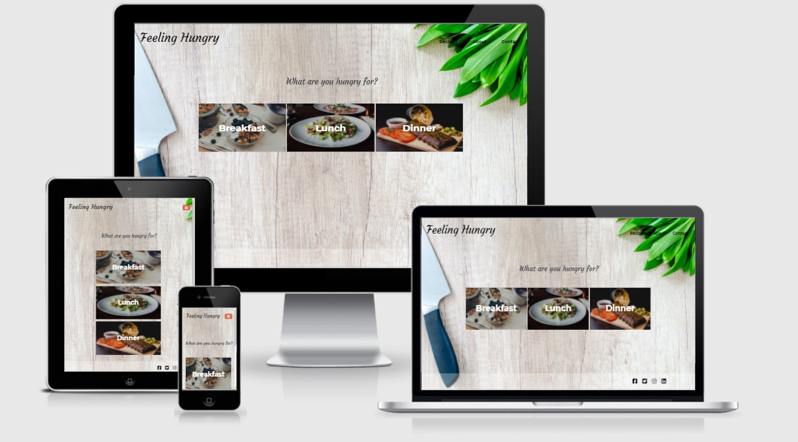

# Feeling Hungry – Milestone Project 2
### View the live project [here.](https://nickchapman1988.github.io/FeelingHungry/)

The aim of the project was to create a mobile-first user-friendly recipe search app for users to find meal ideas. The user can search based on ingredients they have available and the app presents a range of recipes using those ingredients, allowing users to quickly and easily find meal ideas using things they already have in their kitchens.

## Table of Contents

> -	[Overview](#overview)
> -	[Description](#description)
> -	[UX](#ux)
> -	[Features](#features)
> -	[Technologies Used](#technologies-used)
> -	[Testing](#testing)
> -	[Project bugs and solutions](#project-bugs-and-solutions)
> - [Deployment](#deployment)
> -	[Credits](#credits)
> - [Acknowledgements](#acknowledgements)

## Overview
Everyone enjoys good food, but we don't always have the time or energy to be creative in the kitchen. This project aims to help with that, by allowing users to search for recipe ideas using ingredients that they already have available. Variety is the spice of life, or so the saying goes, so rather than making the same meals over and over week in week out, using the Feeling Hungry website to find new and exciting recipes allows users to do something different with the normal ingredients they have in their fridge or cupboards. 

## Description
This is a recipe search app built with a mobile-first design, but intended to be accessible on all devices. My aim with the project was to present a colourful, warm and evocative appearance that felt comforting and relaxed while putting users in the mood to cook, and try new things!

---

## UX
## Strategy

**Business Goals** 

* To make it easy for users to find meal ideas through simple ingredient searches.

* To encourage users to explore new ingredients, recipes and flavours.

* To encourage users to reduce food waste by finding ways to use leftover ingredients.

    
**User Stories**
* "Sometimes after a long day I have no idea what to cook for dinner, and we end up throwing something unhealthy in the oven or getting a takeaway. Being able to cook something using ingredients I've already got without having to think about it would be great!"

* "I'd like to try new things and cook different recipes that I've maybe not tried before, but wouldn't know where to start. Having a list of recipes where I can use the ingredients I've already got would make life so much easier."

* "We always have a full fridge and always end up cooking the same things each week. It would be nice to throw a bit of variety in there, and cook something different without having to go out and buy anything we don't normally buy."

* "I hate wasting food, but sometimes it's really difficult thinking of how to use leftover food up. I'd rather find a way of using things up than end up throwing them away, and it might introduce us to some new meals as well."

    
## Scope

The website is based on a MVP (Minimum Viable Product) methodology, for several reasons:

* Keeps the website uncluttered and minimalistic, avoiding information overload for users
* Makes site easier to navigate, with only key information displayed
* In line with my current abilities
* Meets the necessary needs of the user and business owner 

## Structure

The website is split into four sections - a home (landing) page, an about page, a recipe search page and contact page. The fixed navbar allows the user to easily navigate the site and get in touch, and presents a consistent layout, while the toggle feature makes the navbar more accessible for mobile and tablet devices whilst maintaining consistent positioning. The Home page holds prominent self-explanatory site message and CTA buttons in the centre of the page, with further information accessible on the About page. The Recipes page is clean and simple, giving users a no-fuss search box to utilise and find recipes. The Contact page gives users an easy way to give feedback and contact the site owner.

## Skeleton

* Home Page: <a href="assets/docs/wireframes/home.pdf" target="_blank">Home</a>
* About Page: <a href="assets/docs/wireframes/about.pdf" target="_blank">About</a>
* Search Page: <a href="assets/docs/wireframes/search.pdf" target="_blank">Search</a>
* Recipes (Search Results) Page: <a href="assets/docs/wireframes/recipes.pdf" target="_blank">Recipes</a>
* Contact Page: <a href="assets/docs/wireframes/contact.pdf" target="_blank">Contact</a>

## Surface
I wanted to present a clean, bright background with imagery that reflects the purpose of the site. Use of colourful foods in combination with a bright and clean background serves to put the user in the mood to cook, both by representing a cooking/creative environment and also presenting appealing food images that capture the users imagination and encourage them to explore new foods and recipes.

### Images

Each of the images selected are designed to evoke specific reactions and emotions. The landing page buttons are specific to different mealtimes, and are instantly identifiable as the meal they represent. The main background image is bright and clean, to represent a "blank canvas" for cooking and evoking the kitchen environment. 

### Colours

* As there could be any number of different images and colours presented from the recipe searches, I deliberately chose a 'neutral' palette of colours to achieve good contrast wherever possible, whatever search results (and images) a user is presented with. 
* Text is presented in solid black #000000 in order to contrast strongly against the background as much as possible, with the exception of the meal buttons on the Home page, which use solid white #ffffff in order to contrast against the specific images used as backgrounds.
* A bright orange colour #da6542 was used as a spot colour to help buttons and recipe cards stand out, allowing users to easily locate and use these features.

### Typography

* I used Google Fonts to browse interesting fonts. 'Courgette' was used for headings and sub-headings as it adds a touch of elegance and flourish associated with "traditional" cookbooks (the sort of home-style cookery of the likes of Delia Smith and Mary Berry!). 'Montserrat' was used for the bulk of the page text, as it pairs well with 'Courgette' and presents an easy-to-read larger character font, again often found in cookbooks.

---

## Features
#### Navbar
* I wanted users to easily be able to navigate the site from every page.
* The navbar resizes responsively into a toggle button at smaller screen sizes, to enable users to still navigate their way around the site.
* The navbar uses a static text underline and colour change to indicate present site location, and colour change hover effect and text underline on the other links whilst navigating to a new page.
* The user can click on site title to take the user back to the Home page.

#### Home 
* Contains prominent and direct site message to immediately catch user's attention and indicate the site's purpose.
* Prominent and colourful meal 'buttons' are simple to understand and easily direct users how to operate using imagery and text to indicate what each button is for.

#### Recipes
* Contains prominent direction on how to use the search function, and presents recipe results in a grid layout for easy navigation.
* Grid layout ensures recipe presentation responds to different screen sizes, enabling all users to browse recipes easily whilst making best use of the full screen.
* Hover animation to allow users to focus on individual recipes.

#### About
* This page details what the site is about and how to use the recipe search. 

#### Contact
* Allows users to easily get in touch with site owner.
* Makes use of the EmailJS API to allow user messages to be emailed directly to site owner.

### Existing Features

### Features Left to Implement
* Adding the ability to navigate through multiple pages. Currently limited due to 'points' quota allowed with Spoonacular API.
* Additional filters to allow more specific recipe seaches e.g. by cuisine type, by flavour ('sweet', 'savoury', 'spicy' etc.)

---

## Technologies Used

#### Languages:
* [HTML](https://en.wikipedia.org/wiki/HTML)
* [CSS](https://en.wikipedia.org/wiki/CSS)
* [Javascript](https://en.wikipedia.org/wiki/JavaScript)

#### Libraries:
* [Bootstrap v5.0](https://getbootstrap.com/) - A mobile-first responsive library used to construct various parts of the project, including extensive use of the grid system for 
layout, the Nav Menu and Contact Form, as well as Javascript/Popper bundle for the navbar Toggle function.
* [Popper](https://popper.js.org/) - Included as a requirement of Bootstrap. Used in menu toggler.
* [GoogleFonts](https://fonts.google.com/) - 'Courgette' and 'Montserrat' fonts.
* [Balsamiq](https://balsamiq.com/) - used for the creation of wireframes.
* [FontAwesome](https://fontawesome.com/) - Used for the nav bar toggler icon.
* [JQuery](https://jquery.com) - The project uses JQuery to simplify DOM manipulation.

#### APIs:
* [EmailJS](https://www.emailjs.com/) - Allows the Contact Form to send emails directly to the site owner.
* [Spoonacular](https://spoonacular.com/food-api) - Recipe and Nutrition API with over 5000 recipes, nutrition information for thousands of products and ingredients, as well as detailed recipe instructions and images used as part of this site.

#### Version Control:
* [Github](https://github.com/) - Used to store the code and use of GitHub Pages to deploy the website. 
* [Gitpod](https://gitpod.io/) - Used as the primary version control IDE for development to further push and commit code to GitHub.

#### Other:
* [Code Institute Course Content](https://courses.codeinstitute.net/) - Primary source of learning code.
* [ChromeDevTools](https://developers.google.com/web/tools/chrome-devtools) - Used frequently to detect any issues/bugs or layout differences.
* [CSS-Tricks](https://css-tricks.com/) - Used as a general resource for CSS tips and questions.
* [W3Schools](https://www.w3schools.com/) - Used for examples and tutorials.
* [Unsplash](https://unsplash.com) - Used to find suitable background and images throughout the project.
* [Hover.css](https://ianlunn.github.io/Hover/) - Used for simple animation on recipe boxes.
* [Stack Overflow](https://stackoverflow.com/) - Used for general troubleshooting and examples.
* [favicon.cc](https://www.favicon.cc/) - Used to create site favicon.

---

## Testing
* Forms testing: to ensure the website was functioning as it should, I tested each of the forms on different devices and browsers. This was done by clicking the 'Submit' 
button on the Contact Form without any text in inputs to make sure it resulted with the desired response of 'Please fill out this field'.
* Links (Internal & External): Each of the links when clicked have been checked so that the user is directed to the desired location. For a better UX experience, I made sure 
each link has either a colour change or colour-changing icon when hovered (with exception of the logo when visible) and included a target="_blank" attribute so that a new 
browser tab is opened when clicked.

* Testing across various devices: I used BrowserStack for this, in addition to feedback from my friends and peers. The devices on which the website was tested are as follows:

    * Android Mobile:
        * **Samsung:** Galaxy S8, Galaxy A42
        
    * Android Tablet:
        * **Samsung:** Tab A6, Tab S4
    
    * IOS Mobile:
        * **iPhone:** 5, 11 Pro, 12
    
    * IOS Tablet:
        * **iPad:** Pro 12.9 2020

* Tested on Chrome, Firefox, Safari and Microsoft Edge

* Ensured the website was also responsive on all pages through [Google Mobile Friendly Test](https://search.google.com/test/mobile-friendly).
- 1. **Home:**

* 2. **Recipes:**

* 3. **About:**

* 4. **Contact:**

#### Validation
HTML - [W3C](https://validator.w3.org/) - Markup Validation

CSS - [W3C](https://jigsaw.w3.org/css-validator/) - CSS Validation

Javascript - [JSHint](https://jshint.com/) - Javascript Validation

#### Project Bugs and Solutions
* Contact form initially didn't work as intended; while testing, no emails were being sent. I investigation using Chrome Dev Tools, and consulting the Code Institute course material again, and discovered I had attached the "onsubmit" property to the Submit button, rather than the form itself. Removing the "onsubmit" property from the button and adding it to the form element instead fixed the problem.
* Found while testing on mobile devices that there was a massive empty space on the right-hand side of the screen when the site was zoomed out. Added additional CSS styling to restrict width and height to 100%, set max-width to 100% and set any x-overflow to hidden. This seemed to fix the issue.

#### Testing User Stories

## Deployment
* Go to [GitHub](https://github.com/) and sign in, or sign up for an account.
* Once a Github account was created, I opened a new repository by clicking the green button "new". To create this project, I used the Code Institute's student 
[template](https://github.com/Code-Institute-Org/gitpod-full-template).
- Click on the green "gitpod" button to open [Gitpod](https://gitpod.io/), a cloud-based version control software or IDE, which was used to write all code for this project.
- It was then pushed or saved in the terminal to Github where it is stored in a [repository](https://github.com/NickChapman1988/SleepingDragonTerrain)
- Under "Settings", scroll down to Github Pages and select "Master Branch" in the Source section, to where the page was automated.
- Once this was selected, the project was pushed to Github pages and the URL is then displayed
- To access the code, it can be run locally by either selecting "clone" which provides a URL to use on a local machine or "download" to download the zip file on to a local machine.

## Credits
* Main background photo 'kitchen knife and green leaf vegetable on tabletop' by [Lukas Blazek](https://unsplash.com/@goumbik?utm_source=unsplash&utm_medium=referral&utm_content=creditCopyText) on [Unsplash](https://unsplash.com/?utm_source=unsplash&utm_medium=referral&utm_content=creditCopyText)
* Breakfast image 'berry and nuts' by [Dan Counsell](https://unsplash.com/@dancounsell?utm_source=unsplash&utm_medium=referral&utm_content=creditCopyText) on [Unsplash](https://unsplash.com/?utm_source=unsplash&utm_medium=referral&utm_content=creditCopyText)
* Lunch image 'vegetable salad in plate' by [Louis Hansel](https://unsplash.com/@louishansel?utm_source=unsplash&utm_medium=referral&utm_content=creditCopyText) on [Unsplash](https://unsplash.com/?utm_source=unsplash&utm_medium=referral&utm_content=creditCopyText)
* Dinner image 'roasted ribs with sliced tomatoes' by [Alexandru-Bogdan Ghita](https://unsplash.com/@bogzilla?utm_source=unsplash&utm_medium=referral&utm_content=creditCopyText) on [Unsplash](https://unsplash.com/?utm_source=unsplash&utm_medium=referral&utm_content=creditCopyText)
* Undefined search images use 'pile of French macaroons' by [Keila Hötzel](https://unsplash.com/@keilahoetzel?utm_source=unsplash&utm_medium=referral&utm_content=creditCopyText) on [Unsplash](https://unsplash.com/?utm_source=unsplash&utm_medium=referral&utm_content=creditCopyText)  
* Seach bar clear icon adapted from [this answer](https://stackoverflow.com/a/33683886) by Josh Crozier on Stack Overflow.
* Semi-transparent layer over meal images from [this answer](https://stackoverflow.com/a/27015815) by 'd4ncer' on Stack Overflow. 
* Passing Javascript variables to another page from [this tutorial](https://lage.us/Javascript-Pass-Variables-to-Another-Page.html) on Lage.us

## Acknowledgements
* My Mentor, **Nishant Kumar**, for his guidance throughout this project.
* The Slack Community for their help and support.
* My family and friends for their feedback and help with testing.
* My wife and son for their endless patience, support and lending of devices for testing!
